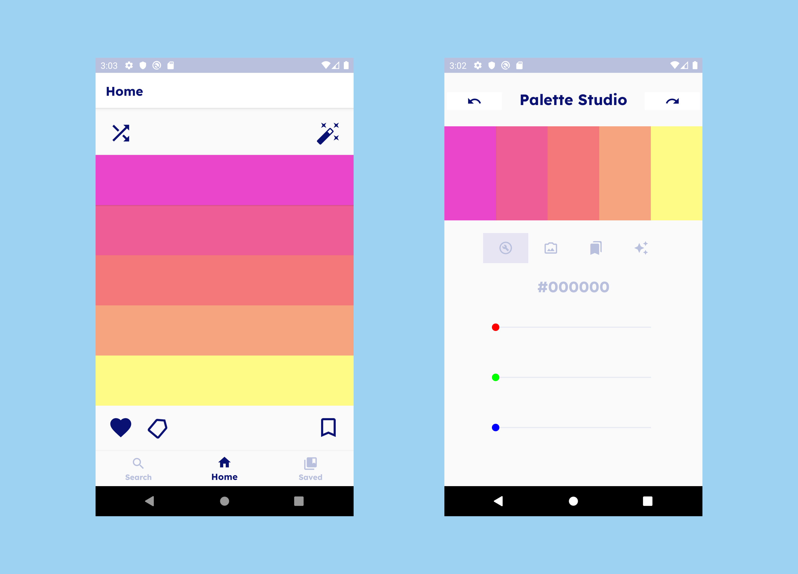

# ColourCloud

 
Colour Cloud is a palette-generating mobile app that helps you find the perfect colour scheme for your work or art from the comfort of your phone! Browse endless colour schemes (at random or using keywords) and create your own palettes with the Palette Studio.  <b>Currently this app is a WIP.</b> Check out the high-fidelity prototype by pressing the Figma icon below.

 

## Screenshots

